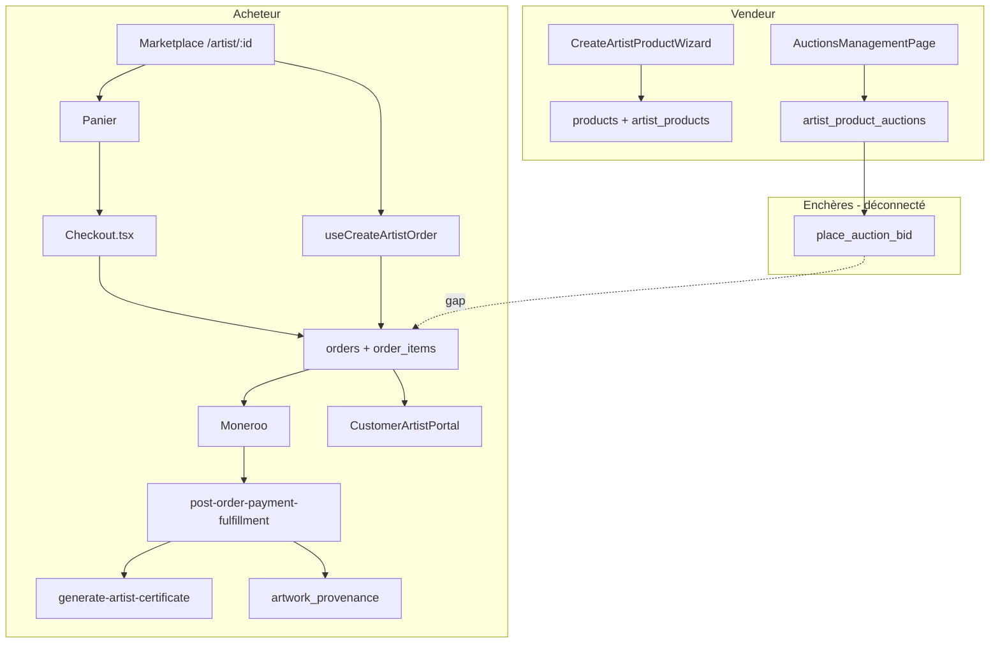

# Audit exécutif — Système Œuvre d'artiste

**Date :** 26 mai 2026  
**Périmètre :** Audit 360° (fonctionnel, technique, sécurité, UX/conversion, performance, tests)  
**Statut global :** **Fonctionnel mais non production-grade** — maturité estimée **62/100**

---

## Synthèse en 60 secondes

Le système Œuvre d'artiste est **riche en fonctionnalités** (wizard vendeur 8 étapes, fiche produit premium, certificats, provenance, 3D, enchères, collections, portail acheteur). L'architecture est cohérente avec les 4 autres verticales e-commerce de la plateforme.

En revanche, **3 failles critiques** menacent la confiance client et l'intégrité des ventes :

1. **Certificats post-paiement probablement non générés** (mauvais en-tête d'appel Edge Function).
2. **Survente possible des éditions limitées** via le panier (absence de verrouillage inventaire).
3. **Enchères : placement d'offres cassé** (incohérence des noms de paramètres FE ↔ hook).

Sans correction de ces points, le positionnement « galerie d'art premium » est exposé juridiquement et commercialement.

---

## Scorecard par domaine

| Domaine                    | Score  | Commentaire                                                                     |
| -------------------------- | ------ | ------------------------------------------------------------------------------- |
| Couverture fonctionnelle   | 78/100 | Création, marketplace, checkout, certificats, enchères, portail — large spectre |
| Intégrité transactionnelle | 45/100 | Verrou éditions limitées partiel ; rollback commande incomplet                  |
| Sécurité & conformité      | 58/100 | RLS présente ; policies certificats trop permissives côté INSERT système        |
| UX & conversion            | 65/100 | Fiche riche mais friction checkout artiste ; sidebar vendeur sur page publique  |
| Performance                | 70/100 | Lazy-load 3D/certificats ; N+1 résiduel sur stats vendeur                       |
| Tests & observabilité      | 40/100 | E2E smoke uniquement ; 0 test unitaire dédié artiste                            |
| SEO & accessibilité        | 72/100 | Schema.org, SEOMeta ; utilitaires a11y wizard présents                          |

---

## Top 10 risques (priorisés)

| #   | Sévérité     | Risque                                                                                           | Impact business                                                          | Effort      |
| --- | ------------ | ------------------------------------------------------------------------------------------------ | ------------------------------------------------------------------------ | ----------- |
| 1   | **Critical** | Appel `generate-artist-certificate` sans `x-internal-secret` depuis le fulfillment post-paiement | Certificats absents après achat — promesse d'authenticité non tenue      | S (1-2 j)   |
| 2   | **Critical** | Checkout panier (`Checkout.tsx`) sans RPC `check_and_increment_artist_product_version`           | Double vente d'œuvres en édition limitée                                 | M (3-5 j)   |
| 3   | **Critical** | `AuctionDetailPage` envoie `auctionId`/`bidAmount` au lieu de `auction_id`/`bid_amount`          | Enchères inutilisables côté acheteur                                     | S (1 j)     |
| 4   | **High**     | Verrou optimiste incrémenté **avant** paiement confirmé (`useCreateArtistOrder`)                 | Faux « épuisé », version drift, abandon panier bloque d'autres acheteurs | M (3-5 j)   |
| 5   | **High**     | Edge Function certificat crée l'enregistrement **sans PDF** ; générateur client séparé           | PDF manquant ou incohérent selon le chemin                               | M (5-8 j)   |
| 6   | **High**     | Pas de pont enchère gagnante → commande Moneroo                                                  | Enchère « vendue » sans encaissement automatisé                          | L (2-3 sem) |
| 7   | **High**     | Shipping artiste = barèmes statiques (pas de transporteur réel)                                  | Sous/sur-facturation, litiges livraison œuvres fragiles                  | L (3-4 sem) |
| 8   | **Medium**   | `ArtistProductDetail` affiche `AppSidebar` (navigation vendeur)                                  | Confusion acheteur, fuite UX dashboard                                   | S (1 j)     |
| 9   | **Medium**   | Deux systèmes de certificats (`artist_product_certificates` vs `artwork_certificates`)           | Complexité, données divergentes                                          | M (1-2 sem) |
| 10  | **Medium**   | E2E artiste = smoke (pas achat + certificat + édition limitée)                                   | Régressions non détectées en CI                                          | M (1 sem)   |

---

## Cartographie E2E (vue métier)

**Chemins d'achat :**

| Chemin                                   | Fichiers                                  | Verrou édition limitée | Certificat auto         |
| ---------------------------------------- | ----------------------------------------- | ---------------------- | ----------------------- |
| Achat direct (`useCreateOrder` → artist) | `useCreateArtistOrder.ts`                 | Oui (RPC)              | Via webhook si fix auth |
| Panier → Checkout                        | `Checkout.tsx`, `checkout-order-items.ts` | **Non**                | Via webhook si fix auth |
| Enchère gagnante                         | `AuctionDetailPage`, SQL `end_auction`    | N/A                    | **Non branché**         |

---

## Roadmap recommandée

### Quick Wins (1-2 semaines)

1. Corriger l'auth Edge Function certificat dans `post-order-payment-fulfillment.ts` (+ test manuel sandbox).
2. Unifier le verrou inventaire éditions limitées dans **tous** les chemins checkout (panier inclus).
3. Corriger les paramètres `usePlaceBid` / `AuctionDetailPage`.
4. Retirer `AppSidebar` de la fiche produit publique `ArtistProductDetail`.
5. Déplacer l'incrément de version **après** `payment_status = completed` (ou réserver avec TTL + release).

### Stabilisation (30 jours)

6. Pipeline certificat unique : Edge Function génère PDF (service headless ou template serveur).
7. Workflow enchère : cron `update_auction_statuses` + notification + création commande pour l'enchérisseur gagnant.
8. Portail client : vérification requête commandes (`customer_id` vs `auth.uid()` + jointure `customers`).
9. Suite E2E : achat édition limitée (2 sessions parallèles), certificat visible, enchère basique.
10. Alertes observabilité : taux certificats générés, conflits version, échecs enchères.

### Scale (90 jours)

11. Intégration transporteurs art (DHL/FedEx art) avec devis temps réel.
12. Page vérification publique certificat (`/verify/:code`).
13. Consolidation certificats/provenance (modèle unique + blockchain optionnelle).
14. Dashboard vendeur artiste unifié (ventes, enchères, certificats, shipping).

---

## KPIs de suivi post-corrections

| KPI                                                    | Cible                 | Mesure                                          |
| ------------------------------------------------------ | --------------------- | ----------------------------------------------- |
| Taux certificats générés / commandes artiste éligibles | > 99 %                | Logs Edge + table `artist_product_certificates` |
| Incidents survente édition limitée                     | 0                     | Tests concurrence + monitoring RPC              |
| Taux conversion fiche → panier                         | +15 % relatif         | Analytics `view_item` → `add_to_cart`           |
| Taux enchères avec offre valide                        | > 95 % des tentatives | Logs RPC `place_auction_bid`                    |
| Temps chargement fiche artiste (LCP)                   | < 2.5 s               | Lighthouse CI                                   |

---

## Décision recommandée

**Ne pas lancer de campagne marketing « galerie d'art »** tant que les 3 risques Critical (#1–#3) ne sont pas corrigés et validés par E2E dédiés.

Après Quick Wins, le système peut supporter une **bêta contrôlée** (volume limité, éditions non limitées ou stock = 1 avec process manuel).

---

_Rapport technique détaillé : [AUDIT_OEUVRE_ARTISTE_TECHNIQUE.md](./AUDIT_OEUVRE_ARTISTE_TECHNIQUE.md)_
