# 📊 Diagrammes Visuels - Système d'Affiliation

**Date**: 28 Janvier 2025  
**Auteur**: Analyse Automatisée  
**Version**: 1.0

---

## 📋 Table des Matières

1. [Schéma de Base de Données](#schéma-de-base-de-données)
2. [Flux d'Inscription Affilié](#flux-dinscription-affilié)
3. [Flux de Tracking de Clic](#flux-de-tracking-de-clic)
4. [Flux d'Attribution de Commission](#flux-dattribution-de-commission)
5. [Workflow de Commission](#workflow-de-commission)
6. [Architecture Frontend](#architecture-frontend)

---

## 🗄️ Schéma de Base de Données

### Diagramme ER (Entity Relationship)

```mermaid
erDiagram
    affiliates ||--o{ affiliate_links : "crée"
    affiliates ||--o{ affiliate_commissions : "gagne"
    affiliates ||--o{ affiliate_withdrawals : "demande"
    affiliates ||--o{ affiliate_clicks : "génère"
    
    products ||--o| product_affiliate_settings : "configure"
    products ||--o{ affiliate_links : "promu"
    products ||--o{ affiliate_clicks : "tracé"
    products ||--o{ affiliate_commissions : "génère"
    
    stores ||--o{ products : "vends"
    stores ||--o{ affiliate_links : "héberge"
    stores ||--o{ affiliate_commissions : "paye"
    
    orders ||--|| affiliate_commissions : "crée"
    orders ||--o{ affiliate_clicks : "convertit"
    
    affiliate_links ||--o{ affiliate_clicks : "reçoit"
    affiliate_links ||--o{ affiliate_commissions : "génère"
    affiliate_links ||--o{ affiliate_short_links : "raccourci"
    
    auth_users ||--o| affiliates : "est"
    
    affiliates {
        uuid id PK
        uuid user_id FK
        text email UK
        text affiliate_code UK
        integer total_clicks
        integer total_sales
        numeric total_revenue
        numeric total_commission_earned
        numeric pending_commission
        text status
        timestamptz created_at
    }
    
    product_affiliate_settings {
        uuid id PK
        uuid product_id FK UK
        uuid store_id FK
        boolean affiliate_enabled
        numeric commission_rate
        text commission_type
        numeric cookie_duration_days
        numeric min_order_amount
    }
    
    affiliate_links {
        uuid id PK
        uuid affiliate_id FK
        uuid product_id FK
        uuid store_id FK
        text link_code UK
        text full_url
        integer total_clicks
        integer total_sales
        numeric total_commission
        text status
        timestamptz created_at
    }
    
    affiliate_clicks {
        uuid id PK
        uuid affiliate_link_id FK
        uuid affiliate_id FK
        uuid product_id FK
        text tracking_cookie
        timestamptz cookie_expires_at
        boolean converted
        uuid order_id FK
        timestamptz clicked_at
    }
    
    affiliate_commissions {
        uuid id PK
        uuid affiliate_id FK
        uuid affiliate_link_id FK
        uuid product_id FK
        uuid store_id FK
        uuid order_id FK
        numeric order_total
        numeric commission_amount
        text status
        timestamptz created_at
    }
    
    affiliate_withdrawals {
        uuid id PK
        uuid affiliate_id FK
        numeric amount
        text payment_method
        text status
        timestamptz created_at
    }
    
    affiliate_short_links {
        uuid id PK
        uuid affiliate_link_id FK
        uuid affiliate_id FK
        text short_code UK
        text target_url
        integer total_clicks
        boolean is_active
    }
    
    products {
        uuid id PK
        uuid store_id FK
        text name
        numeric price
        boolean is_active
    }
    
    stores {
        uuid id PK
        uuid user_id FK
        text name
    }
    
    orders {
        uuid id PK
        uuid store_id FK
        numeric total_amount
        text affiliate_tracking_cookie
        timestamptz created_at
    }
    
    auth_users {
        uuid id PK
        text email
    }
```

### Diagramme de Relations Simplifié

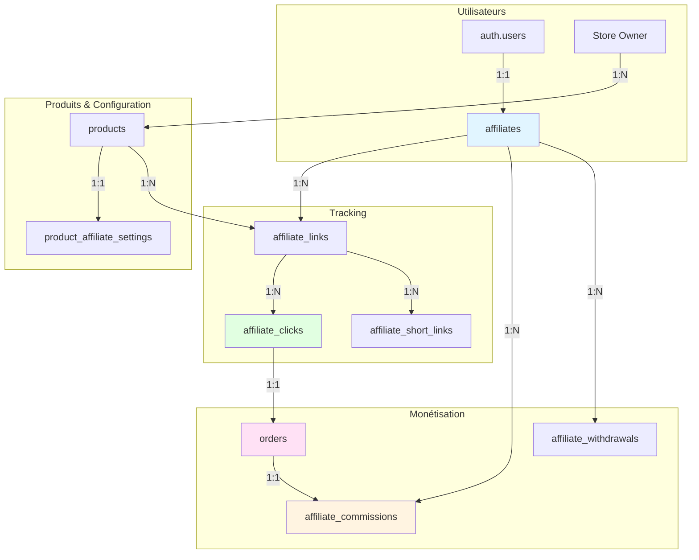

---

## 🔄 Flux d'Inscription Affilié

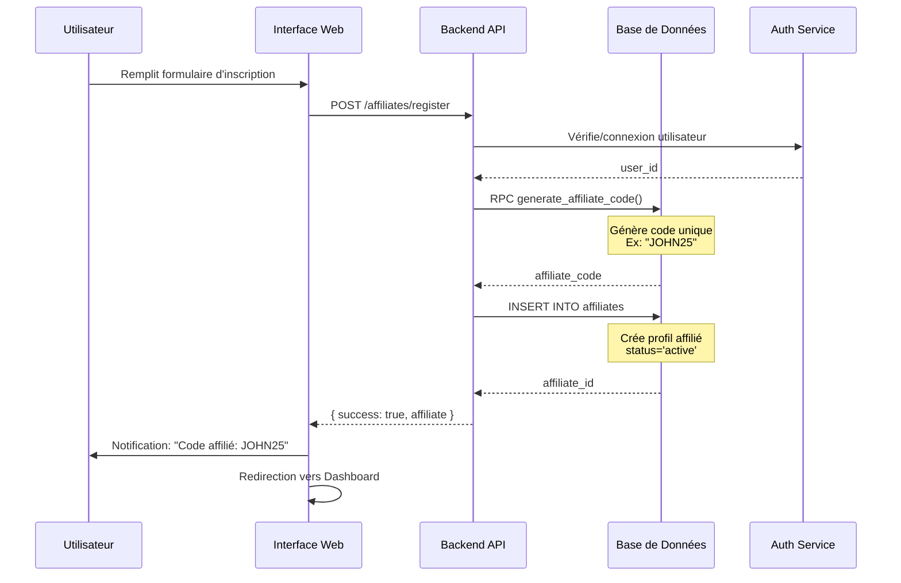

---

## 🖱️ Flux de Tracking de Clic

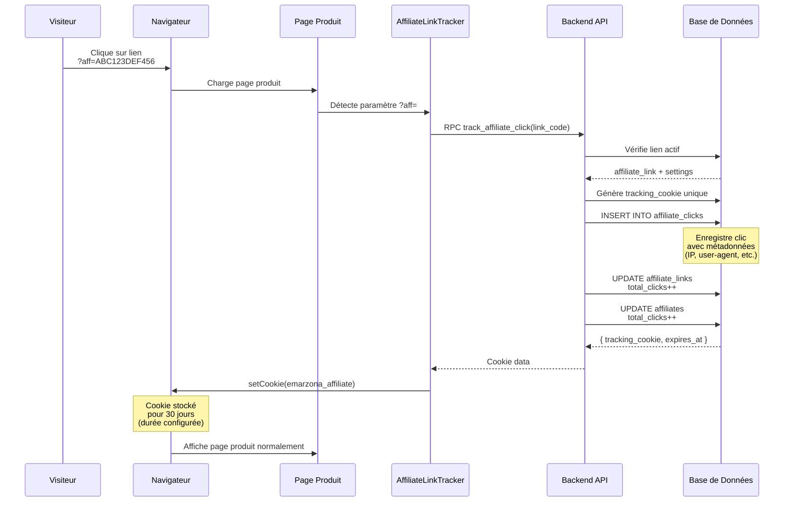

---

## 💰 Flux d'Attribution de Commission

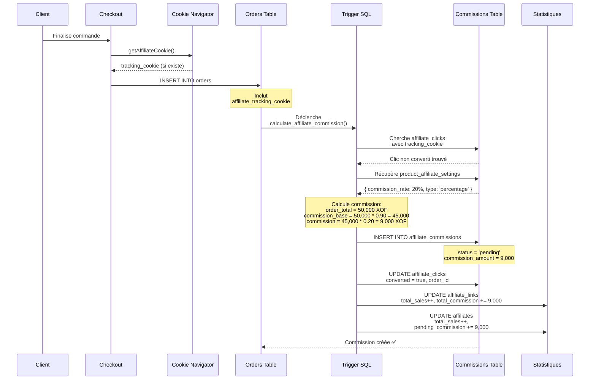

---

## 📋 Workflow de Commission

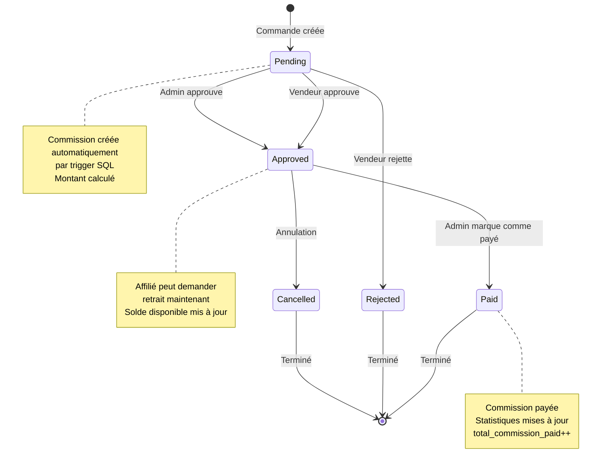

### Workflow de Retrait

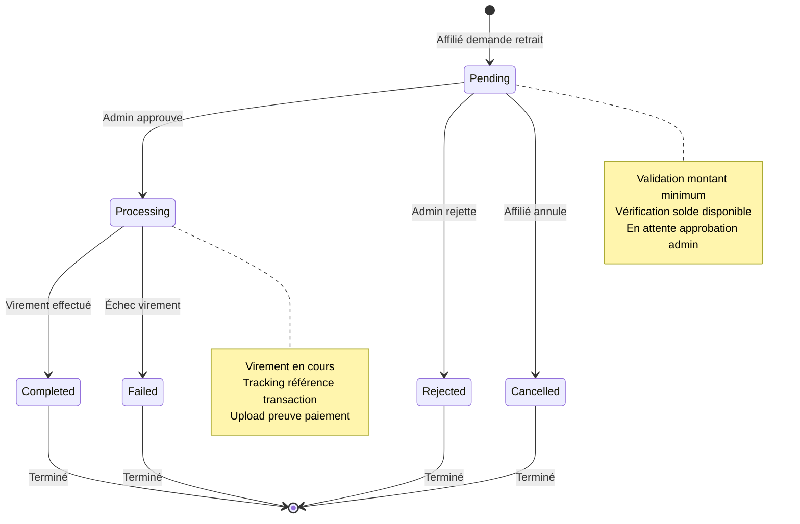

---

## 🎨 Architecture Frontend

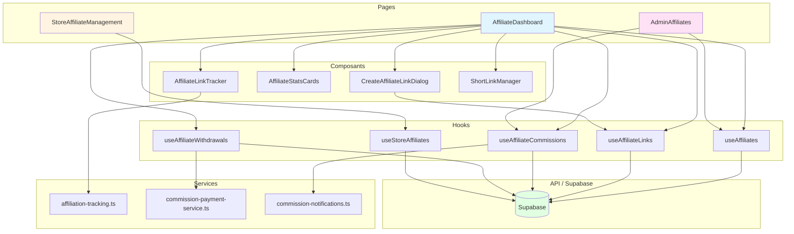

---

## 🔄 Flux Complet : De l'Inscription au Paiement

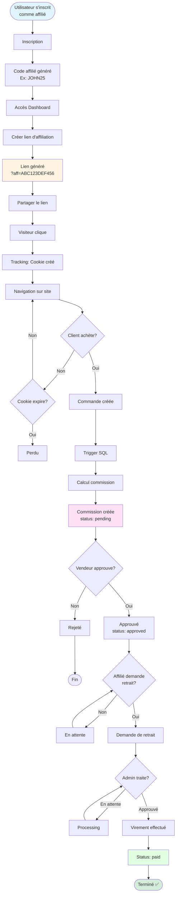

---

## 📊 Architecture des Statistiques

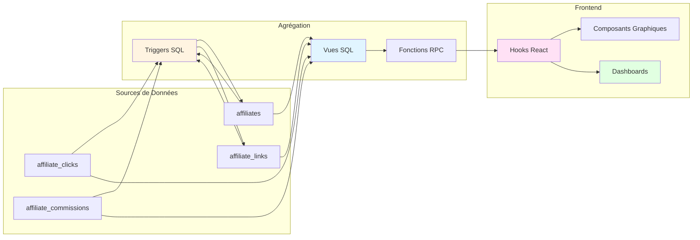

---

## 🔐 Sécurité et RLS (Row Level Security)

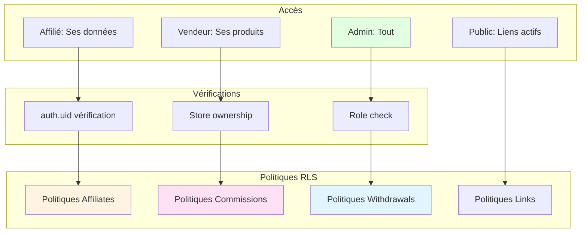

---

## 📈 Exemple de Calcul de Commission

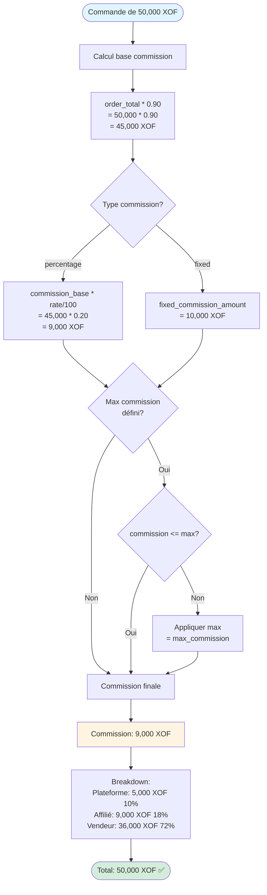

---

**Document généré le** : 28 Janvier 2025  
**Version** : 1.0

*Ces diagrammes peuvent être visualisés dans un éditeur Markdown compatible Mermaid (GitHub, GitLab, VS Code avec extension Mermaid, etc.)*

