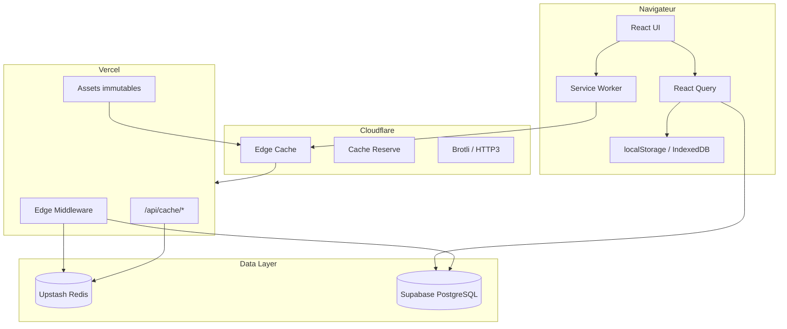

# ARCHITECTURE FINALE — Cache Enterprise Emarzona

## Stack adaptée (Vite/React, pas Next.js)

Les concepts Next.js 15 (`revalidateTag`, `unstable_cache`, ISR, PPR) sont **mappés** ainsi :

| Next.js 15         | Emarzona (Vite SPA)                                  |
| ------------------ | ---------------------------------------------------- |
| `cacheTag()`       | `CacheTag` enum + `registerKeyUnderTag()`            |
| `revalidateTag()`  | `revalidateTag(queryClient, tag)`                    |
| `updateTag()`      | `updateTag(queryClient, tag)`                        |
| `unstable_cache()` | `RedisService.getOrSet()` + React Query              |
| Route Cache        | Service Worker + CDN headers                         |
| Data Cache         | React Query + marketplace-cache                      |
| ISR                | SWR marketplace (90s soft / 10min hard)              |
| PPR                | `initialData` sync localStorage + background refetch |

---

## Diagramme architecture



---

## Structure code

```
src/lib/cache/
├── tags.ts              # CacheTag, cascades invalidation
├── config.ts            # CACHE_STRATEGIES, Cache-Control builders
├── query-tags.ts        # Tag → React Query keys
├── swr.ts               # stale-while-revalidate, stale-if-error
├── invalidation-engine.ts  # revalidateTag, invalidateByEvent
├── CACHE_WARMER.ts      # Post-deploy warm cache
└── index.ts             # API publique

src/lib/redis/
├── client.ts            # Upstash REST
├── service.ts           # RedisService + getOrSet
├── tags.ts              # purgeTags, purgeSeoMetaCache
├── metrics.ts           # Hit/miss tracking
├── local-fallback.ts    # LRU in-memory si Redis down
└── index.ts

api/cache/
├── invalidate.js        # POST purge Redis
├── warm.js              # POST warm URLs
├── health.js            # GET santé
└── metrics.js           # GET métriques admin

src/components/monitoring/
└── CacheMonitoringDashboard.tsx
```

---

## Flux invalidation produit

1. Vendeur sauvegarde produit → `useCatalogCacheInvalidation()`
2. `invalidateCatalogCaches()` purge React Query + localStorage
3. `POST /api/cache/invalidate` purge Redis SEO + app cache
4. Prochain visiteur marketplace → fetch Supabase → repopulate caches
5. Bots SEO → middleware regénère meta fraîche

---

## Tolérance aux pannes

| Panne               | Fallback                                      |
| ------------------- | --------------------------------------------- |
| Supabase down       | `stale-if-error` SWR (jusqu'à 1h marketplace) |
| Redis down          | `local-fallback.ts` LRU 1000 entrées          |
| Cloudflare down     | Vercel origin direct                          |
| API invalidate down | Client invalidation React Query seule         |

---

## Déploiement zero-downtime

- Vercel: déploiement atomique par commit
- SW: `SKIP_WAITING` + prompt reload
- Post-deploy: `POST /api/cache/warm` (cron Vercel recommandé)
- Rollback: redeploy commit précédent + warm cache

---

## Variables d'environnement

```env
# Serveur (Vercel)
UPSTASH_REDIS_REST_URL=
UPSTASH_REDIS_REST_TOKEN=
CACHE_INVALIDATION_SECRET=

# Client (optionnel)
VITE_CACHE_INVALIDATION_SECRET=
VITE_BUILD_ID=
```

---

## Cloudflare (configuration dashboard)

À activer manuellement :

- Cache Reserve
- Smart Tiered Cache
- Argo Smart Routing
- Brotli compression
- HTTP/3
- Early Hints

Page Rules recommandées :

- `*.emarzona.com/assets/*` → Cache Everything, Edge TTL 1 year
- `*.emarzona.com/api/*` → Bypass cache
