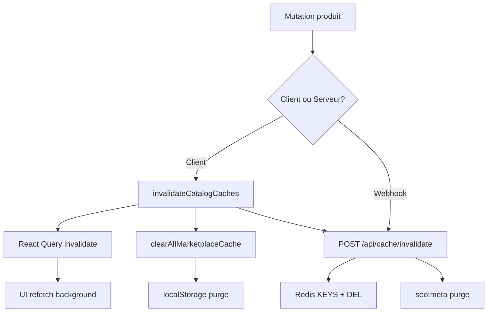

# CACHE_INVALIDATION_ENGINE — Emarzona

## Vue d'ensemble

Le moteur d'invalidation intelligent purge en cascade **toutes les couches** lors d'une mutation catalogue.

```
Produit modifié
    ↓
invalidateCatalogCaches() [client]
    ├── React Query: marketplace-products, facets, search, recommendations, homepage
    ├── localStorage/IndexedDB: marketplace_*
    └── POST /api/cache/invalidate [edge]
            ├── Redis: emz:v1:*product*
            ├── Redis: seo:meta:v1:*
            └── Tag index purge
```

---

## Événements et cascades

| Événement                              | Tags purgés                                                                                               |
| -------------------------------------- | --------------------------------------------------------------------------------------------------------- |
| `product:create/update/delete/publish` | product, products-list, store, category, search, facets, recommendations, homepage, marketplace, seo-meta |
| `store:update/mutation`                | store, store-detail, products-list, homepage, marketplace, seo-meta                                       |
| `service:mutation`                     | service, products-list, search, facets, marketplace, seo-meta                                             |
| `course:mutation`                      | course, products-list, search, facets, marketplace, seo-meta                                              |
| `artist:mutation`                      | artist, artist-collection, auction, products-list, search, marketplace, seo-meta                          |
| `import:catalog`                       | Tous product cascade + category + facets + recommendations                                                |
| `deploy`                               | homepage, marketplace, recommendations, seo-meta                                                          |

---

## API client

```typescript
import { revalidateTag, invalidateByEvent, invalidateFull } from '@/lib/cache';

// Équivalent Next.js revalidateTag()
revalidateTag(queryClient, CacheTag.PRODUCT, { entityId: 'prod-123', storeId: 'store-1' });

// Par événement métier
invalidateByEvent(queryClient, 'product:update', { entityId: 'prod-123' });

// Multi-couches (client + Redis)
await invalidateFull(queryClient, 'product:mutation', { entityId: 'prod-123' });
```

---

## API serveur

```bash
# Invalider par tags
curl -X POST https://www.emarzona.com/api/cache/invalidate \
  -H "Authorization: Bearer $CACHE_INVALIDATION_SECRET" \
  -H "Content-Type: application/json" \
  -d '{"tags": ["product", "marketplace", "seo-meta"]}'

# Par événement
curl -X POST ... -d '{"event": "product:mutation"}'
```

---

## Intégration existante

| Hook/Fichier                     | Déclencheur                      |
| -------------------------------- | -------------------------------- |
| `useCatalogCacheInvalidation`    | Mutations produit vendeur        |
| `cache-invalidation.ts`          | `invalidateRelatedCache` entités |
| `useProductManagementOptimistic` | CRUD produits                    |
| `EditGenericProductWizard`       | Sauvegarde produit               |

---

## Webhook Supabase (recommandé)

Créer un Database Webhook sur `products`, `stores` :

```sql
-- Edge function: cache-invalidate-webhook
-- POST /api/cache/invalidate avec event dérivé de table + operation
```

---

## Diagramme


